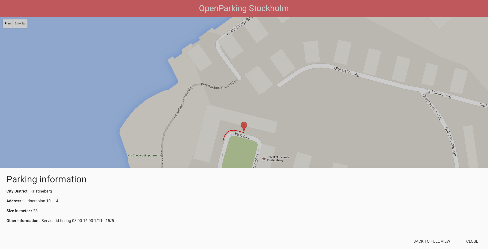

# OpenParkingStockholm

OpenParkingStockholm is a simple solution (made for a job application) which provides information about different car parks over Stockholm.

Markers are placed all over the city to show where are the parkings.
A red line is also drown on the map, to show the zone where parking is.
To keep the maps clean from too much markers, I added the _js-marker-clusterer_ which merges markers when they are too much on the same place.

If you click on a marker :  , a bottom sheets modal with different informations about the parking will be shown :


Two buttons on the bottom allows to :
- Go back to the full view
- Only close the modal and keep the zoom on the current area

This project can be _easily_<sup>1</sup> reused for another city as I've used the city name as parameter to center the city on screen  :
```sh
// The city where the map will be centered
var cityName = "stockholm";
```

To run test unit, open **SpecRunner.html** file and expect no failure


## Technical choices

- **Materialize** (<http://materializecss.com/>) as the CSS Framework
- **Atom** (<https://atom.io/>) as my Text Editor
- **GitKraken** (<https://www.gitkraken.com/>) to manage my git repo locally
- **Git Flow** (<http://danielkummer.github.io/git-flow-cheatsheet/>) as my right-hand best tool to manage repository operations
- **js-marker-clusterer** (https://github.com/googlemaps/js-marker-clusterer)

<sup>1</sup> The new city needs of course same json skeleton fetched from open data
